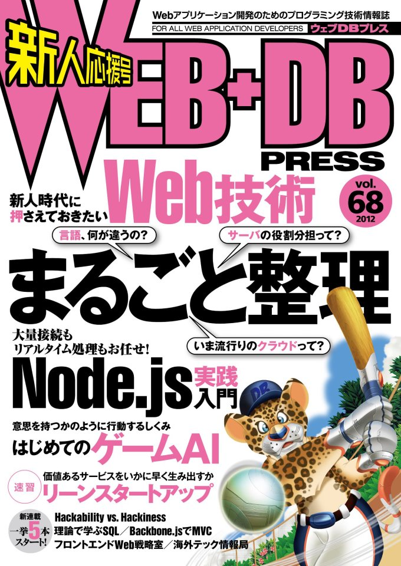

Perl 5.16 Updates @ Hokkaido.pm Causal #01
==========

<address>Yappo: yappo あっと shibuya.pl  hikarie Perl Mongers</address>

あ
---

Casual な会だという事で来月出るって噂の Perl 5.16 の新機能をカジュアルに紹介します。

installing
---

今はまだリリースされてないので近い状態の 5.15.9 を

    $ curl -kL http://install.perlbrew.pl | bash
    $ perlbrew install perl-5.15.9
    $ perlbrew switch perl-5.15.9

ちなむと
---

5.10 とは違って 5.12 以降は一年おきに出そうっていう目標でリリースサイクルでやってるので、 5.14 から 5.16 への変更点って 5.8 から 5.10 と比べて少ないです。
あと、最近の最新版はだいぶ安定してるので気軽に最新版に出来ますし、よっぽどじゃ無ければ 5.8 とかのコードも動きます。
ついでに言うと 5.16 が出ると 5.12 以前のバージョンは一応サポート対象外となりますが、安定してるのでバージョン代えなくても問題にならないし、気になるなら少し頑張ってバージョン上げるなりするといいのかな。

PHP も似たようなサイクルだった。

本題
==

More CORE subs are callable through references
---

Perl5 Core Function の CODE reference が取れるようになった。
一般ユーザの使いどころはわからないけど、ライブラリ開発者が捗るのかな?

    use strict;
    use warnings;
    use 5.015;
    my $time = \&CORE::time;
    warn $time->();

Unicode Symbol Names
---

シンボル名への utf8 サポートが行われました。
utf8 フラグ付きの関数名を caller で取る時も utf8 フラグが付くようになりますし、 utf8 フラグを付けてシンボルテーブルから取り出す必要があります。他にも bless, tie goto...

Unicode Symbol Names (code)
---

    use strict;use warnings;use 5.015;use utf8;
    sub 北海道 { say('札幌') }
    my $hokkaido = \&{"北海道"};
    $hokkaido->();
    do {
        no utf8;
        # utf8 フラグ立ってないのでシンボル名解決出来ない                                                                        
        my $hokkaido = \&{"北海道"};
        $hokkaido->();
    };

Support for Embedded Nulls
---

今まで文字列変数に \0 が入ってると、様々な場面で文字列が \0 以前で終端に達していたが、その挙動が無くなった。
\0 は \0 として内部的に扱われるようになった。

Support for Embedded Nulls code
---
    use strict;use warnings;use 5.015;
    sub foo { say('bar') }
    main->foo;
    my $baz = "foo\0hoge";
    { no strict 'refs';
        *{$baz} = sub { say($baz) } ;}
    main->$baz; # 5.16 before/after で呼ばれるメソッドが変わる

Autoloaded sort Subroutines
---

sort の第一引数に渡す関数名が AUTOLOAD に対応した。ので、柔軟な sort 関数作れるかもだけど、使いどころだいぶ casual じゃなさそう。

Autoloaded sort Subroutines code 1/2
---

    use strict;use warnings;use 5.015;
    use Test::More;our $AUTOLOAD;
    sub AUTOLOAD {
        my($key) = $AUTOLOAD =~ /([^:]+)$/;
        return 0 if $a eq $b;
        return -1 if $a eq $key;
        return 1 if $b eq $key;
        return 0;
    }

Autoloaded sort Subroutines code 2/2
---

    my @list = qw/ foo bar baz /;
    my @foo = sort foo @list;
    is($foo[0], 'foo');
    my @bar = sort bar @list;
    is($bar[0], 'bar');
    my @baz = sort baz @list;
    is($baz[0], 'baz');
    done_testing;

\_\_SUB\_\_
---

今現在のサブルーチンのコードリファレンスを返します。
再帰処理するクロージャを簡単に書くのに便利っぽい。

    use strict;
    use warnings;
    use 5.015;
    my $foo = sub {
        @_ ? say(@_) : __SUB__;
    };
    $foo->()->('bar');

"no feature;" now means reset to default
---

no feature; を使えば default 状態に戻せる。

New function "fc" and corresponding escape sequence "\F" for Unicode foldcase
---

fc 関数追加された。なにこれ？
case fold が云々らしいけど、良くわかってない。

Supports (almost) Unicode 6.1
---

そのまんま。

まとめ
---

Perl 5.16 の新要素で僕がちょっと興味引いた物の紹介をしました。5.10から5.14の間のトピックスを知りたい人は、来週出る Web+DB PRESS の Perl 連載で cho45 先生が言及してるので読むとよいでしょう。 

ご清聴有り難うございました
===