位置情報系処理のお話 a.k.a 続・自文書抽出日本的住所
==========

<address>Yappo</address>

お詫び
---

I'm sorry, I was not in time for the English documentation.

お詫び
---

本物の国交省データの取り扱いをお見せする予定でしたが、山岡さん不参加により不可能となりました。
データサイズでかすぎで XML 系モジュールで取り扱うのが現実的ではなかったので、僕は正規表現でデータを抜き出してから、再度ループで必要なデータ組み立てをする作戦で適切な速度とリソースで処理できました。

本物の KEN_ALL.csv はお見せできます。

はじめに
---

* LINE とかの特定のサービス名とか出すと炎上するので、具体的に出しません
* 資料の文字数すくなめなので、聞き忘れたら誰かのブログか gihoy.jp 見て

LINE 担当ではありません
---

* 合コンでモテないし、呼ばれないので呼んで下さい
* YAPC の思い出は楽しくいきましょう

自己紹介
---

* 位置情報系の基盤作ってます
* ここ最近は別のことやってた
* 特に紹介する自己なかった
* ドラクエ10で平田やってます

ほか位置情報関連の実績
---

* YAPC::Asia 2007 Tokyo - 自文書抽出日本的住所
* Shibuya.PM #7 - 自然文章から日本の住所を頑張って出力
* livedoor Techブログ : 住所正規化APIをロケタッチでリリースしたよ！１
* livedoor Techブログ : 鉄道情報APIをロケタッチでリリースしましたのお知らせ
* ほか、 Geo 系の CPAN モジュールや KEN_ALL.csv パーサ等

前回のあらすじ
---

* だれかの代打で急遽プレゼンやりました
* Geography::AddressExtract::Japan の発表をしました
* 京都こわい、北海道恐い

今回は
---

* 北海道恐く無い、京都はスルーしよう
* 北陸こわい、熊本市ェ。。。

妥協最重要
---

位置情報を取り扱うには完璧を求めたら大変！

* 緯度経度の精度1mm単位まで求める?
* ジオコーディングは号レベル枝番レベルデータ安く無いよ
* 住所データの正当性チェック、小字とか通称どうすんの

やる事に見合った精度を
---

* スマホの測位データ使うサービスに10m単位の精度はいらない
* 商店などのデータを扱う時に、山の中の住所は(ほぼ)いらない
* 集計用白地図にガススタのアイコンいらない
* 頑張りたければ、サービスや会社を買うほうが安上がりの時も

agenda
---

* CPAN Module Talk
* Service Talk

CPAN Module Talk
---

CPAN Module Talk
---

どうやらここは YAPC らしいので一応 Perl の話をする姿勢だけみせときます。

Geo::Coordinates::Converter
---

<a href="https://metacpan.org/module/Geo::Coordinates::Converter" target="_blank">https://metacpan.org/module/Geo::Coordinates::Converter</a>

HTTP::MobileAgent
---

<a href="https://metacpan.org/module/HTTP::MobileAgent::Plugin::Locator" target="_blank">https://metacpan.org/module/HTTP::MobileAgent::Plugin::Locator</a>

KEN_ALL.csv
---

<a href="https://metacpan.org/module/Parse::JapanesePostalCode" target="_blank">https://metacpan.org/module/Parse::JapanesePostalCode</a>

Geo::Hash Geo::Hash::XS
---

<a href="https://metacpan.org/module/Geo::Hash::XS" target="_blank">https://metacpan.org/module/Geo::Hash::XS</a>

Geo::Coordinates::Converter::Format::GeoHash
---

<a href="https://metacpan.org/module/Geo::Coordinates::Converter::Format::Geohash" target="_blank">https://metacpan.org/module/Geo::Coordinates::Converter::Format::Geohash</a>

GeoHash.pm
---

<a href="https://github.com/yappo/p5-GeoHash" target="_blank">https://github.com/yappo/p5-GeoHash</a>

中休み
---

中休み
---

次のテーマに移る前にかるい話をしようとおもう

Open Streat Maps のカンファレンス行ってきた
---

* 海外参加者多数
* 日本開催初めてと思えないホスタビリティ
* ランチ後東大の芝生に皆あつめて集合写真
* ドリンク食事無料、コインを渡して貰ってゴミ返した時にコイン戻ってくる
* 懇談会や、屋形船も無料

after party in 屋形船
---

日本人少数なので、大トロとか刺身あまりまくった
---

北陸の話 1/5
---

テストケースのデータを抜粋したほうが話速い

    石川県羽咋郡志賀町赤住8字の23番地
    success 石川県羽咋郡志賀町赤住 8字の23番地
    
    石川県珠洲市宝立町柏原128字2の67番地
    success 石川県珠洲市宝立町柏原 128字2の67番地
    
    石川県輪島市三井町洲衛10部11-1
    success 石川県輪島市三井町洲衛 10部11-1
  
北陸の話 2/5
---

    石川県白山市鶴来本町四丁目ト41
    success,changed,j2n 石川県白山市鶴来本町 4-ト41
    
    石川県白山市鶴来本町4-ト41
    success 石川県白山市鶴来本町 4-ト41

北陸の話 3/5
---

    # ア部 とかは 部 を消す
    石川県七尾市藤橋町ア部８－２
    success,changed,z2h 石川県七尾市藤橋町ア 8-2
    
    # 武部 は普通の地名
    石川県中能登町武部８－２
    success,changed,z2h 石川県中能登町武部 8-2

北陸の話 4/5
---

    富山県富山市五福九区4174-5
    success,changed 富山県富山市五福9区 4174-5
      
    富山県富山市五福8区3512
    success 富山県富山市五福8区 3512
    
    福井県鯖江市横越町第1号43番地2
    success,changed 福井県鯖江市横越町 1号-43番地2

北陸の話 5/5
---

他の地域には無いルールが多くて苦労した。北陸に縁のある人にインタビューしたところ、今の正規化ルールで違和感無いそうでした。

熊本市の話 1/3
---

熊本市が今年の4月に政令指定都市になりました。政令指定都市になったので行政区が出来るのですが(奥州市などの合併の都合で区が地名に付くケースもある)それがヤバイ

本物の熊本市を http://www.city.kumamoto.kumamoto.jp/Content/Web/Upload/file/NNsD_70256_21Bun_64853_210106.pdf から抜粋した画像でお見せする。

熊本市の話 2/3
---

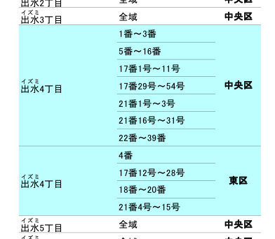

熊本市の話 3/3
---

おわかり頂けただろうか。丁目レベルでなくて、号レベルで行政が変わるのである。

今年の始めに調査したら「小学校の学区域単位で行政を別けた」という合理的なような合理的じゃないような理由でした。

Service Talk
---

未来の話
---

iYappo の検索ロジックに位置情報の概念を入れて、現在地に最適なコンテンツを返して最終的には検索クエリを入れなくともトップページを見ただけで最適な情報が出るサービスが今年当たりに出来てるだろうと今世紀の始めから考えていました。

住所自動検出を作ったのも、ページのコンテンツに対して位置情報を割り当てて検索スコアに活用するとかそういうのを考えてました。 Geo::Coordinates::Converter 作ったのもその流れですね。

駅前検索
---

ロケタッチで出している駅前検索というサービスがあるのですが、検索クエリを入れなくともその場その時に有用な結果を返す検索エンジンと見れば僕の青地図が完成に近づいたのですが、まだまだ未来はちょっと遠くにあるようです。

位置情報の重要性は加速する
---

釈迦に説法ですが

* 誰しも位置情報端末を持ってる
* LINE などのデバイスを使ったリアルコミュニケーションの活発化
* iOS6 で皆こまる
* そもそも人間は移動型生物

意外と位置情報絡むサービス多い
---

    ニュース, 食事, レジャー, 住む, 天気, 地図, イベント, 交通, 冠婚葬祭, 通販、その他いっぱい

たぶん人が人でいる限り位置情報は根幹的な物でしょう。次から、統計や位置情報関連技術の実装に深く入ってきます。

Growth Hacking(笑)
---

最近良くわからない単語がバズってるけど、そういう事が簡単に出来るのが当たり前だよね。って思ってたから GrowthForecast のプロトタイプ作って kazeburo さんに完成してもらった。

実際使ってみて不満な所もあるから HRForcast も産まれたし社内に導入したら喜びの声多数でしたし社外の状況も皆さんが知ってる通り。

実例
---

例えば競合サービスの cehckin tweet 数のグラフを取っていて、自社サービスと他社サービスの利用動向に差があるか無いか、差がある時にはどういう事が考えられるか。といった事が可能。

お盆休みの傾向の変化例
---

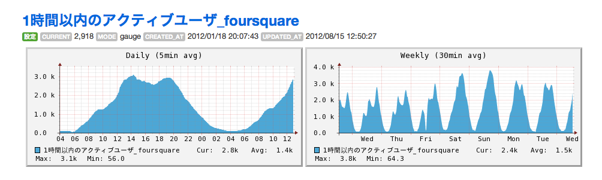

金曜まで通常で月曜から違いが見える。

白地図 API
---

* 位置情報系の場合は単純なグラフではたりない
* グラフでも、テキストファイルを見ても良いけど感覚的に理解出来ない
* 位置情報だから地図にデータを書けばいい
* 視覚化重要

なぜ自前で白地図を作るか
---

* Web API を組み合わせれば作れるの知ってる
* 既製品もある

労力を考えれば既製品を使うと良いが、自社サービスのレポーティングで使う以上は自前で作っていたほうが細かい要求に応えやすい。
今後、スマホが重要になって位置情報が絡むコンテンツが重要になってくる時に、他サービスでの分析にも使い回せるようになるので、今作り始めたほうが良い。

ヒートマップ
---

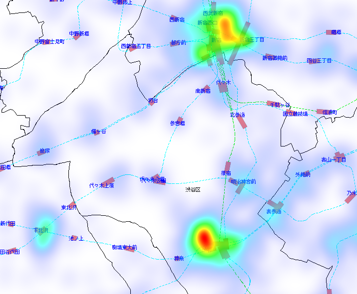

GeoHash
---

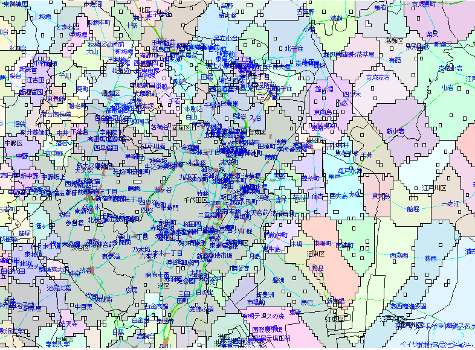

デモ
---

やるなら全社的に使える物を
---

* 位置情報が関連するコンテンツは意外に多い
* 始めから全社的に使える物として作った
* 使い方ドキュメント書いて社内 tech talk でも説明した
* 最近、使ってるサービスがちらほら出てる

出来るならば外に出す事も
---

* まだまだ Open & Share してても良い会社っぽい
* 基本的に外に出せるAPIのつもりで作ってる
* 一定の精度の自身があるものと、外の人の需要を見て出してる
* 成果のいくつかはリリースしている

白地図システムの作り方
---

材料(データ)
---

* 国土数値情報ダウンロードサービス
* - 行政区域ベクトルデータ
* - 鉄道路線データ

本当は道路や河川情報も欲しいけど
---

って OSM で LT したんだけど、昨日作ってる人の画面がちらっと見えたら琵琶湖が書いてあった気がする

材料(ソフトウェア)
---

* MySQL 5.1 GIS 拡張
* Perl
* Imager
* Imager::Heatmap
* Geo::Hash

駅情報API
---

* 駅というのは日本の位置情報処理で重要な POI
* ekidata.jp のデータを使っている
* そのまま使うと一般の感覚とずれる物になるので、ある程度の加工してから出してる

路線名変換
---

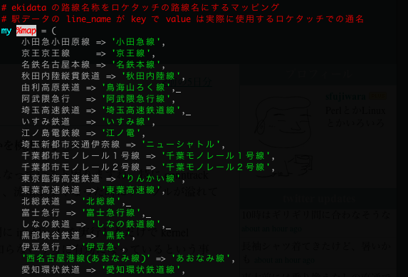

駅名変換
---

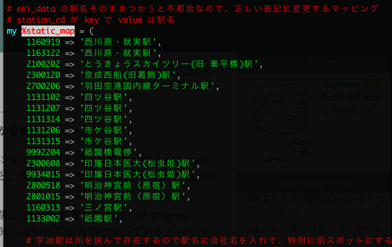

駅、停留所ルール
---

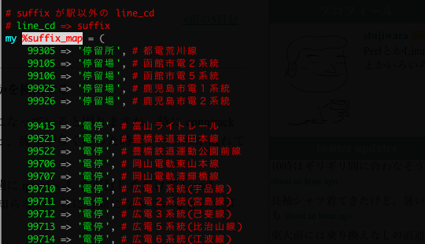

住所正規化
---

* 噂の数MBのモジュールで処理しているやつ
* 基本的には KENN_ALL.csv ベースで住所正規化の処理してる

正規表現のほんの一部
---

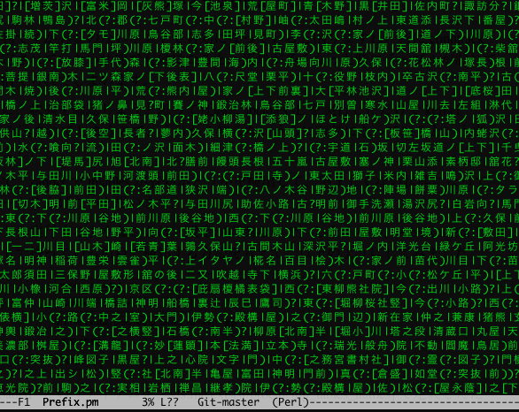

住所正規化やってる事
---

* 地名と、丁目番地号と、ビル名を分離する
* 丁目番地号の抜き出し正当性チェック
* 丁目番地号とビルがつながってたら、さらに分離
* 丁目番地号 の数値表記を正規化
* わかる限りの地名のぶれを正規化
* 合併前の地名だったらフラグ付ける

合併後住所に変換するのは作るリソース足りてない

デモ
---

ハイフンルール
---

丁目番地の区切りは「の」とか「-」とかあるけど、ハイフンの文字いっぱいあるからその辺も網羅する

    -ｰ・‐ー－−―─ノの

数値部分が正しいか
---

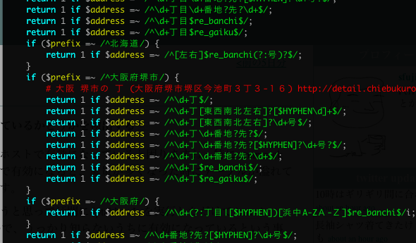

丁目という名前の町
---

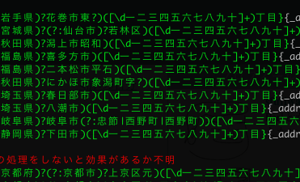

北海道
---

* Hokkaido.PM いったついでに色々インタビュー
* 色々話したら、基線とかは店とか建物とか少な過ぎて無視すれば良さそうなのわかった
* 条丁目のルールはだいぶシンプル

北海道のコード片
---

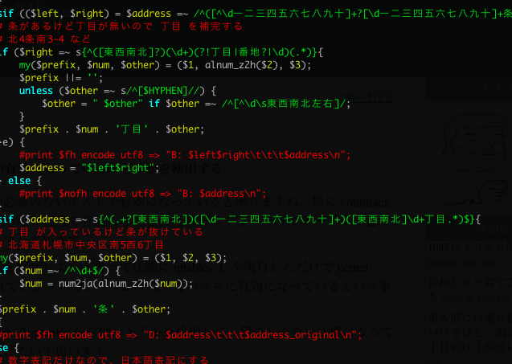

京都の通り名
---

* Kyoto.PM いったついでに色々インタビュー
* ジオドスの中の人の話で、実地調査しないとちゃんとやるのは不可能
* 京都のデータをよく見ると、通り名の他に正しい住所番地が書いてある事おおい
* 「あれ?通り名だけ消せばよくね?」

京都の通り名の秘伝のコード
---

    sub address_normalize_kyoto {
    ...
    }

晒そうと思ったけど、長かったから割愛

ジオハッシュから自治体コードを取る
---

geohash ベースで扱う処理が一部あるので自治体コードを引ける API を作ってある。
geohash に複数の自治体が含まれる可能性があるので、複数の候補を返して使う側で選択をするアプローチ
6文字 geohash が丁度良い感じだった。

GeoHash いいよ
---

スマホアプリ上から、だいたいの現在地を撮りたい場合に糞真面目に自治体境界データを GIS に突っ込んでくえり投げてもいいけど、簡単な GeoHash の集まりを日本全国に敷き詰めて GeoHash と自治体の紐付けをするとコスト安く簡易逆ジオコーディング作れる。

6文字の GeoHash だと約600m四方の精度になり、19万個の GeoHash で日本を埋め尽くせるのでデータ量も数MBで住んで軽いし、普通の index で検索出来るから速い。

スマホ実用的な GPS 精度だと十分な場合もあると考えられる。

正規化API周りはDBつかわない
---

全ての処理を正規表現ベースで書いているので起動時に正規表現のコンパイル走って10秒かかって、メモリ食う。

      PID USER      PR  NI  VIRT  RES  SHR S %CPU %MEM    TIME+  COMMAND
      941 www       15   0  350m 224m 2680 S  0.0  1.4   0:00.65 starman worker

でも CoW が聞くのでプロセス増やしまくって並列展開出来る。適当に起動させてても数百qpsでてる。

geocoding
---

* 街区レベル位置参照情報
* データの中の表記揺れ多いので正規化(正規化APIつかう)

geocoding
---

      while (my $row = $csv->getline ($fh)) {
          next unless $i++;
          my(undef, $pref, undef, $city, $code, $aza, $lat, $lng, $genten, $kubun) = map { s/\s//g; $_ } @{ $row };
          my($region_id, $address_town, $address_name, $address_number) = normalize("$pref$city$aza");

use MySQL GIS
---

大体こういう SQL で緯度経度取れる

    SELECT spot_region_id, address, banchi, Y(latlng) AS lat, X(latlng) AS lng FROM geocode WHERE spot_region_id=? AND address=? AND banchi=?

一致が無ければ、要素を削る町域でもヒットしなければ諦める。

reverse geocoding
---

超簡単。

    WHERE MBRContains(GeomFromText(CONCAT('LineString( ', %s + 0.01, ' ', %s + 0.01, ', ', %s - 0.01, ' ', %s - 0.01, ')')), latlng)
    ORDER BY GLength(GeomFromText(CONCAT('LineString(%s %s, ', X(latlng), ' ', Y(latlng), ')'))) LIMIT 20

近いデータから順に返すだけ。

reverse geocoding tips
---

番地の中心点から近い順なので、たまに自治体が隣のほうを選んでしまうので、自治体境界データを使って違う自治体の結果を返さないようにしてる。
町域レベルでやる事も考えてる。

ジオコーディング周りは MySQL 任せ
---

      PID USER      PR  NI  VIRT  RES  SHR S %CPU %MEM    TIME+  COMMAND
     0941 mysql     15   0 6286m 5.5g 7556 S  4.7 35.1   6241:33 mysqld

まとめ
---

* NHN Japan は人材募集してるっぽいです

以上です
===
