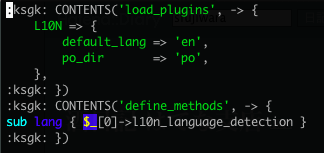

社内開発簡単化と世界で戦う開発を考える技術
==========

<address>Yappo</address>

今回の目的
---

僕がこの一年の間に言われた仕事と関係無くやってた事の成果を発表します。

Development Framework
---

「サービス固有のコードを書く事に集中できる環境を提供する」というのが WAF(Web Application Framework)の役割の一つではありますが、オープンな WAF という物は得てして社内事情を考慮しないものなので、結果的に「社内事情の多岐に渡る作業」を開発者が行うハメになります。
このセッションでは、既存の WAF をうまく利用しつつ社内事情を考慮した雛形を作る事で、真の「サービス固有のコードを書く事に集中できる環境を提供」を目指したお話になります。

ミッションステートメント
---

ここ数年の間に YAPC::Asia では発表されてこなかった、仕事で実用的なWeb アプリケーション開発の話をします。
特に毎月何個もサービスをリリースするような環境で必要になってくる、プロジェクトの雛形を作る時の考え方その実装時の知見をシェアします。
話の前提として Amon2 を利用した開発を前提とする。
また、その雛形開発の副産物となる実装の紹介をします。

具体的には、このプレゼンの後に僕の働いてる会社にエントリーして、無事ぼくと一緒に開発するようになった時に知っとくと得する情報ばかりです。

Team Geek 良い本でした
---

kdmsnr さんから贈呈してもらった Team Geek は、割と当たり前の事をしっかりと活字になっているので良い本です。わりと僕は反省しました。

最初にミッションステートメントを書いておくとぶれなくていいって Team Geek にも書いてありました。

アジェンダ
---

* ありがちな開発手順
* 雛形作成のポイント
* 雛形作り直しに、反省ポイント
* Ksgk
* その他の成果物など
* 継続的開発、運用的視点

注
---

このプレゼンで言及される環境は、特定の会社に限定されるわけでは無いです。色々混じってます。
あと、一部誇張してる所もあります。

ありがちな開発手順
===

例えば Amon2 を使ってたら
---

    $ amon2-setup.pl BeerMoris

などのように WAF 標準のセットアップスクリプトを使って雛形を作る。

これは机が飛んでくる事例です。(僕らはインフラじゃないので椅子が使えません)

僕らはエンジニアの端くれなので、悪い所を具体的に言えなければなりません。このケースでは何でしょう?
---

ただ一つのデメリット
---

社内環境が一切考慮されていない

Q. それでも標準 setup script を使う理由?
---

A. startup なので当面はサービスが一つだけ
---

机返して下さい。すみませんでした。
社内インフラも何も決まってない状態で雛形とか言って本当にごめんなさい。
サービスがリリースされた後には、管理画面や別サービス等のプロジェクトを始める事があると思うので、その時に開発環境の標準化を一緒に考えた方が確実です。

A. WAF とかみんな好き勝手に使ってるし、俺は俺WAF作ってるし
---

好き勝手に使ってるのが良いか悪いかは判断出来ないけど、突然隣の同僚が病欠になってしまって急に良くわからないWAFで書かれたコードのメンテをする事になって、初日から障害多発とかいう状況になったら嫌でしょ?

2/2
---

なるべくなら使う道具は揃えておいた方がノウハウ溜まりやすいし誰かが助けてくれやすくなるし、社外でも使われている物を使うと新しい人の学習コストも下がるかもしれないし、誤差かもしれない。し、開発コストってそういう所じゃなかったりするのが社会の厳しさ。あと歴史ある会社だと層も言ってらんないけど、新しいプロジェクトくらいはなんとかしたいね。

A. 特に何も考えてない
---

僕と一緒に考えましょう。

A. 足りない部分は、既存のプロジェクトからコピペするよ
---

普段はコピペプログラミング嫌ってるくせに、どうせ最初だけだからって気にする事無くやりがち。「最近始まった開発プロジェクトはあれだから、あれ使っとけば大丈夫！」とか良くわからない自信で使うんですよね。ミドルウェアとかは標準的に統一されてたりするとちょっと残念。

コピペ駆動開発デメリット
---

* 設定ファイルの内容を誰も説明出来ない秘伝のタレとカス
* httpd の設定が自由すぎて、インフラの人が欲しいログフォーマット吐いてなくて椅子が飛んでくる
* コピペ忘れでバグってハマって時間無駄にする
* コピペ元の人はコピペされてる事を意識してないから、自分のとこだけバグ直して follower のバグは治らない
* 新人の人が路頭に迷う

特に問題なのが
---

基本的な WAF の雛形に補足する形で社内事情に特化したコードをコピペ量産するので、ノウハウが固まらなかったりバグ修正情報が周知されない、周知されても自分が関係しているかがわからなくて危険な状態になる。
あとは、新しく入ってきた開発者が、新規開発をする時にドキュメントがあったとしても既存の社内開発の流儀を他のプロジェクトのコードから学習しないと安心して開発出来ないケースがでてくる。

社内開発環境の雛形で捗る
---

コピペ駆動開発のデメリットを無くす為の社内標準雛形。

雛形以外の統一化手段
---

社内固有の API を利用する為のモジュール等は、独立した社内用モジュールとして実装してリポジトリ管理をするべきです。もちろん一般的な会社では社内用モジュールを作ってメンテナンスして居ると思います。
しかし、社内モジュールは部品にすぎないので、それを実際のアプリケーションで利用するには手作業で実装を進める必要があります。
社内標準雛形を作ると、こういった部分の手間もカバーするように作り込めるので、社内モジュールとは違った角度での恩恵を受けられます。

雛形作成のポイント
===

バランスが大事
---

実用的な社内標準的な雛形を作る一番のポイントがバランスです。

たとえば、位置情報系サービスを1つ作れば十分な会社なのに、その雛形位置情報サービスを提供する為のイロハを全て入れるのは無駄です。標準の雛形に機能を詰め込みすぎると今度は不要な実装を削除する手間がかかってしまい、結局無かった方が良いと思われてしまいます。

社内ルールを意識する
---

どの会社にもある固有のルールに適した雛形を作るべきです。

* フロントは nginx
* plackup は daemontools で管理

こういった開発ルールが有る場合には、雛形を生成する時に nginx の設定ファイルや daemontools の run ファイルを一緒に作るべきです。

社内独自の設定等は予め書いておく
---

例えば Ikachan Server や GrowthForecast など、社内用のツールが予め提供されている場合には、開発者が簡単に利用出来るような形のモジュールやスクリプトを予め提供するようにします。事前に提供する事により開発者が利用する敷居が低くなり、結果的に良質な開発サイクルにする事が出来ます。

開発から本運用に必要なすべてを盛り込む
---

開発者が雛形を生成してから、サービスリリースを行う為に必要な全てのツールは予め提供しておくべきです。

    schema loader, deploy tools, CI tools, run file, batch loader, translate data loader, sass/scss, js/css packer, etc etc

ただし、専用のミドルウェアを使っている箇所は省くなり、それの設定ファイルを標準で提供するべきです。

既存の WAF に足りない事を補う
---

結果的にはこれは自社 WAF を作った事になります。
Amon2 は、とても小さな WAF なため、いわゆる use parent 'Amon2' をしている context class の拡張が簡単になっていて、コードの見た目にもわかりやすいメンテしやすい雛形を作れています。

そして僕は作った
===

amon2-livedoor-setup.pl
---

* amon2-setup.pl based script
* default implementation

    DB Class, Model, Validation, Exceptions, Constants, Xslate warn_handler, sample controller, ikachan, Teng Schema Dumper, stf tool-kit, ServerStatus::Lite, DBIx::QueryLog, IsuDefender, proclet, ukigumo, growthforecast, application luncher, deploy tools, daemontools, nginx, apache, development server setup script

実際の雛形をちょっと出し
---

file: lib/$path/M.pm
---

    use Data::FormValidator;
    use [% module %]::Exceptions;

model の error 処理を例外でやってるのが嫌なんだけどいい方法なかなかみっかってない。

file: lib/$path/Web/C/Root.pm
---

error の見つけ方があんま良くない。。

file: lib/$path/DB/Slave.pm
---

    use parent qw([% module %]::DB); # use Teng
    for my $method (qw/ insert fast_insert bulk_insert ...  txn_rollback txn_end do /) {
     no strict 'refs';
     *{$method} = sub { die "[% module %]::DB::Slave は slave 用クラスなのに $method を呼び出すなんてとんでもない！！！" };
    }

file: lib/$path/Exceptions.pm
---

    package [% module %]::Exception;
    use parent 'Exception::Tiny';
    use Class::Accessor::Lite ( ro => [qw/ code message /] );

file: lib/$path/Constants.pm
---

    package [% module %]::Constants;
    package [% module %];
    use constant {
      FOO => 1,
    }; # is([% module %]->FOO, 1);

file: lib/$path/Web/View.pm
---

devtools/chk-deploy-config.pl
---

    my $dev_config = do('conf/dev.pl') or die $!;
    my $pro_config = do('conf/pro.pl') or die $!;
    my $has_error = 0;
    for my $key (sort keys %$dev_config) {
     unless (exists $pro_config->{$key}) {
       warn "key:$key not exsit in dev.pl.\n";
       ++$has_error;
    }}
    exit($has_error ? 1 : 0);

かなり普通な感じです
---

submodules
---

依存してる git repository の処理は以下の普通な感じです。

    mkdir "submodules";
    !system 'git submodule add git://foo/bar.git submodules/bar' or die $?;
    chdir 'lib';
    !system 'ln -s ../submodules/bar/lib/Bar.pm Bar.pm' or die $?;
    chdir '..';

雛形作り直しに、反省ポイント
===

何事も順調ではない
---

スマホアプリ、管理画面系、特種アーキテクチャ向け等の多様な用途により、雛形生成スクリプト本体をコピペして複数作ってしまった！
---

deploy script に便利機能追加したら、別のスクリプトにもコピペして反映するメンテ方法！
----

あれ？
---

＞　振り出しの予感！　＜
---

他にも問題が
---

* STF じゃ無くて GreenBusket 使いたいんだけど?
* 国際化対応したいんだけど?
* スマホアプリと管理画面系の雛形混ぜたいんだけど?
* というか app.psgi だけじゃ、雛形足りなくね?

雛形のメンテは通常業務の合間にちまちまやってたので、どれかのスクリプトをメンテしつつ必要な物のコピペメンテするのは大変になってきた
---

あと、テンプレートがスクリプトに内包されてるので、テンプレートの数が多くてメンテ辛いという事もあった
---

YAPC で、これのネタ発表するし新しく作っちゃえ！と思い立ったのが2週間前。出来たのが先週。
---

新しい雛形の要件
---

* よりシンプルに
* 複数の雛形を一元管理して、同じテンプレートは使い回し可能にする
* 必要な追加機能を生成時に選択出来るようにする
* テンプレで埋め込む値(ドメイン名、ディレクトリ名など)は今まで、モジュール名から自動生成してたものをそのまま使えた試しがないので、より社内ルールに合わせて自働生成して、開発者が手動で変更出来るようにする

YAPC に向けた誓い
---

折角、開発の雛形生成のコツを発表するのに皆が持ち帰れるコードとか用意しないの馬鹿だよね、折角作り直すんだから外出し可能な物作らないとね?

Ksgk
===

ksgk
---

ksgk
---

ksgk
---

Ksgk - Knack of the System Generation for Kurouto
---

直訳「玄人の為のシステム生成のコツ」

作りました
---

https://github.com/yappo/p5-Ksgk

アプリケーションの雛形生成を支援する為の簡単ツール。

特徴
---

* 雛形の role を複数定義可能
* role に対する機能拡張を定義可能
* 雛形生成時に core, role, 機能拡張 それぞれに対応した値を複数入力可能
* 上記値の default 生成、 validation を行う callback を実装可能
* 雛形生成前の callback を実装する事で、テンプレートに渡す値を自動生成出来る
* 雛形生成後の callback を実装して git init && git add 等の後処理を実装可能

アーキテクチャ
---

    setup.pl       = ユーザ実装の雛形スクリプト。設定が重要。
    assets/core    = 複数の雛形で使い回せるテンプレート
    assets/roles   = 雛形のテンプレート
    assets/options = 拡張機能のテンプレート

setup.pl
---
    use Ksgk;
    my $ksgk = Ksgk->new(
     argv       => \@ARGV,
     assets_dir => 'assets',
     config     => +{ ...config...} ,
    );

config, core/roles
---

    core_dir => 'core',
    roles    => [
     name        => '雛形名',
     description => '雛形説明',
     options     => [ この雛形で利用可能な拡張機能 ],
    ],

config, options
---

    options => [
     拡張機能名 => +{
      description => '拡張機能の説明',
     },
    ],

config, hooks
---

    hooks => {
     before => sub {
      my $ksgk = shift;
      雛形を生成する直前の hook },
     after  => sub {
      my $ksgk = shift;
      雛形を生成した直後の hook },
    },

config, template_config の中身
---

    hooks.before = テンプレートの値処理の前段階の callback
    hooks.before = テンプレートの値処理の後

config, template_config の中身
---

    core[].name = 基本の設定 key (テンプレートで <ks: $key :gk> で呼ぶ)
    core[].description = 設定の説明
    core[].default = sub { my($conf, $ksgk) } デフォルト値を作って return する
    core[].validation = sub { my($value, $cinf, $ksgk) } 入力された $value の値チェックで、エラーだったら偽を返す

config, template_config の中身
---

    roles.foo[].name = 雛形名'foo'の設定 key (テンプレートで <ks: $key :gk> で呼ぶ)

description, default, validation は core と同じ。拡張機能に関しても同じで roles を options に読み替える。

柔軟な雛形ファイル配置
---

core, roles/:name, options/:name 以下のファイル構造をそのまま雛形として書き出してくれます。
$ksgk->templrate_config の中の key を $key として filepath として書く事で、出力時のファイル名をアプリケーションに合わせて動的書き換え出来ます。

    # $ksgk->templrate_config->{module_path} = 'Foo/Bar' の時
    core/lib/$module_path.pm => lib/Foo/Bar.pm

設定したテンプレート値を使える
---

基本的に Xslate の Kolon 記法になっていて、 $ksgk->templrate_config の中身を tmpl_vars として使えます。

    package <ks: $module :gk>;
    :ksgk: if (1) {

tag_start, tag_end, line_start は、通常使わないであろう文字列にしてある。

機能拡張時に埋め込み可能なテンプレート記法
---

Ksgk のファイルの優先順位は core -> roles -> options という順序になっています。
各ファイル階層に同名のファイルがあった場合、例えば core/README と roles/basic/README がある場合には、下位順位のファイルから読み込まれます。

機能拡張時に埋め込み可能なテンプレート記法
---

下位のファイルからテンプレート読み込み処理されるのですが、下位ファイルの中に CONTENTS(key, value) という function がある時に key - values の組み合わせを記憶しておき、上位の core/README の中に INCLUDE(key) があった場合に、同名の key の CONTENTS の内容を展開します。

複数拡張機能を利用していて同じファイルが複数あった場合には、読み込まれた順に出力されます。

core/lib/$module_path.pm の例
---

options/l10n/lib/$module_path.pm の例
---

出力結果
---

Ksgk にして良かった事
---

* 既存のプロジェクトで他言語処理が必要になった時に、Ksgk を使った雛形リポジトリの options/l10n を見せて必要最小限のコードスニペットを提示する事が出来た
* まだ使い始めて少しなのでこれから

おそらく重要な事
---

特定の機能に関わる最小限のコードレシピが蓄積される事により、既存のレガシーなプロジェクトに対しても十分に参考になる環境になって行くのではないか?

開発のコツ
---

僕は、社内基盤を整備する仕事は本業ではなくて、サービスの開発をやらなきゃいけないので、こういったセットアップツールに使う時間は殆ど取れないです。
だいたいは、新規のサービスを作るとき、そのサービスで新規に必要になる要件が後々他の人も使いそうだなというとき、でかつ実装開始まで数日猶予がある隙をねらってバレないように作ってます。

ツールだけを作る人になってしまうと、多分本気に考えられないというか、実際に使い始めてみた時の不便さとかがわからないので、他の人に使ってもらえるような物にはならないんだとおもいます。

その他の成果物など
===

インストーラ付き script
---

実行時に自動的に依存モジュールを入れて立ち上げたかったので以下のようなコードをスクリプト先頭に入れた。

tiny log
---

Log::Minimal 等の既存のモジュールは、理由は忘れたけど使いづらかったので独自に log method を追加。fluentd を使える為の雛形を用意してあるので、 fluentd と住み別ける。
ログの用途によって method を増やしていけば、これといって困った事にはならないしがっつりやりたいなら fluentd で。

tiny log
---

他言語対応
---

今どきのスマホ時代は、いつ全世界で流行るかわからないので Amon2 ユーザが他言語対応しやすい環境を調えたのが今年の僕です。

Locale::Maketext::Extract::Plugin::Xslate
---

Locale::Maketext::Extract::Plugin::Xslate
Xslate のパーサの結果を解析して template 中の function から翻訳対象となるテキストを抽出出来ます。以下のような l という function で翻訳結果を返す実装になっている template で使えます。

    [% l('string') %]
    [% l('string %1', args[, ...]) %]
    [% IF l('string') = 'FOO' %]

Amon2::Plugin::L10N
---

Amon2 アプリの中で po/ja.po などのファイルを読み込んで翻訳結果を簡単にテンプレート出力する為のプラグインを書きました。

    # in Your.pm
    __PACKAGE__->load_plugins('L10N' => {
     accept_langs => [qw/ en ja zh-tw zh-cn fr /],
    });

Amon2::Plugin::L10N
---

    # in Your/Web/ViewFunctions.pm
    sub l {
     my $string = shift;
     my @args = map { Text::Xslate::html_escape($_) } @_; # escape arguments
     Text::Xslate::mark_raw( Amazlet-> context-> loc($string, @args) );
    }

Amon2::Plugin::L10N
---

    # in po/ja.po
    msgid "Hello"
    msgstr "こんにちわ"
    # in tmpl/index.tt
    [% l('Hello') %]

上のような簡単なサンプルコードで、日本語設定のブラウザでアクセスすると「こんにちわ」が表示されます。

HTTP::AcceptLanguage
---

Accept-Language head parser

    my $lang = HTTP::AcceptLanguage->new(
     $req->header('Accept-Language')
    )->match(qw/ en fr es ja zh-tw /);

RFC 信用するとお家帰れないので作った。

L10N tips
---

僕はテンプレートの中のテキストを l('Hello') のように英語で書くのが好みなのですが、一つの英語表記でも使う場所や言語によっては違う意味になるケースがでてきます。
そういった場合には翻訳すべきテキストに key や id などを割り当てて管理して l('config.helo') のような key をテンプレートに書いてく事になるのですが、長文の英語だと key が表す文章が理解不能になるケースがあって困るので l('Hello###config.helo###') のように msgid と msgstr を同時に記述する雛形を作っている。

L10N tips
---

    # in en_translate.txt
    config.helo=Hello
    # in po/en.po
    msgid="Hello"
    msgstr="Hello"
    msgid="Hello###config.helo###"
    msgstr="Hello"

以上のようなルールで .po ファイルを自働生成している。

Exceptions
---

Perl は基本的に例外処理という概念は無いに等しいのですが、 model の処理で validation error とか、その他の error とかを戻り値ベースで対応してコード書くと reterun code とか考えるのだるくなるので例外ベースで model の error を処理しがちです

Exception::Tiny
---

    package MyE;
    use parent 'Exception::Tiny';
    eval { MyE->throw }
    $@ && MyE->caught($@) && do { ... }

Exception::Tiny source code simple than Exception::Class
---
Exception class の為の最低限の実装しか書いてなくて、拡張は perl らしく CPAN つかう。

Try::Lite
---

Kantan exception Catch

    try {
     MyE->throw;
    } (
     'MyE' => sub {
       say $@;
     }
    );

Exceptions 課題
---

やっpり model の error を exception にするの微妙

継続的開発、運用的視点
====

CI
---

git clone, pull, submodule update などの処理してから carton install, perl Makefile.PL して prove -r t > /tmp/result.txt するコマンド叩いたあとに、 result.txt の内容を ukigumo web api に post するスクリプトを cron で回してる

Makefile.PL
---

    # 素の make test つかうと blib/ にコピーされたりしてうざいので prove 直接たたいてやります
    sub MY::test_via_harness {
      "\tprove -rl t"
    }

これで make test すると prove -rl t してくれる

.proverc
---

    :ksgk: if (!$no_carton) {
    "--exec=carton exec -- perl -Ilib -I."
    :ksgk: }
    -Pretty
    --color
    -v

growthhack
---

GrowthForecast と HRForecast と shib と fluentd とか組み合わせればおっけ。

grouthforecast-worker.pl を同梱してる。

keyword: kazeburo tagomoris

SQL
---

use explain, use index

* SQL 吐くときはかならず explain 通してからクエリちゃんとなってるか見る
* index が使われるクエリを出すこと

for ループの回し方でクエリ数が増えて椅子とぶとかあるけど、上記二点が絶対条件。

QueryLog
---

    if (<ks: $module :gk>->is_development) {
     enable sub { my $app = shift; sub {
      my $env = shift;
      if ($env->{QUERY_STRING} =~ /querylog=1/) {
       $env->{'xdbix.querylog'} = DBIx::QueryLog->guard;
      }
      $app->($env);
     }};
    }

AXS log
---

    my $logdir = $vardir->child('log');
    $logdir->mkpath; chmod 0777, $logdir;
    $logger  = File::RotateLogs->new(
     logfile  => $logdir->child('access_log.%Y%m%d%H%M'),
     linkname => $logdir->child('access_log')
    );
    enable 'AxsLog',
     combined => 1,
     response_time => 1,
     logger   => sub { $logger->print(@_) };

DB replcation
---

* 昔の会社では slave lvs 使ってた事あった
* 入社した時に lvs 使ってない事について質問したら、教えてくれたし実際に運用している人達に全て任せるべきなので今は lvs してない
* sfujiwara さんの 1:3 master:slave
* スタートアップサービスの90%は1master:1slaveでよくてslaveはオンラインバックアップ用途
* 万が一の障害の時があるので MHA + PDNS

デプロイ
---

* shell script
* deploy.sh = opts 解析したりそれに合わせて動かす処理変える
* deploy-function.sh rsync や ssh コマンドで実際の処理本体の function
* deploy-config.sh バラまくホストやファイルなどの設定
* deploy 前に config の妥当性チェック

daemon 配置
---

* リポジトリには run file だけ配置
* mkdir /tmp/_foo_daemons
* cd /tmp/_foo-daemon; ln -s /fo/bar/run
* mkdir log; cd log ; ln -s /fo/bar/log/run
* mv /tmp/_foo-daemon /service/foo-daemon

デプロイ注意
---

rsync で template をバラまく時に、アプリケーションのコードが restart される前にテンプレートが利用されるので、アプリケーション側の仕様とテンプレート側を同時に反映するとエラーになる。DB Schema とアプリケーションでも同様。

deploy script でスケールを考慮する
---

いつなんどきサービスが流行るかもわからないので、いつでもスケールするDB設計やアプリケーション設計をするのは当然ですが、みんな忘れがちな物として新しいサーバが増設されたらどれだけ早く本番投入出来るか！？

スケールする deploy tips
---

* mkdir, chmod
* 設定の自動化
* 特殊な実行バイナリも同時に配布

アプリケーションバラまいたら直ちに正しく動作する順部を deploy script で行う

さいごに
---

「最近出した本」「最近の活動」「最近の夜のお供」などに最適です！
---

以上です
===

