Java For Perl Mongers
==========

<address>Yappo@YAPC::Asia 2014</address>

<b style="color:red">この発表は個人の見識であり、所属する組織やこの勉強会の公式見解とは一切違います</b>
===

自己紹介
---

みなさん YAPC の折り返しにきてるけど楽しんでますかー?
---

１，２，３
---

YAPC 大好き!! (c) daisuke maki

僕の本日の予定
---

* 10:00 YAPC::Asia 2014
* 15:30 会社@渋谷
* 16:30 YAPC::Asia 2014
* 18:00 会社@渋谷
* 21:30 YAPC::Asia 2014 @HUB
   
こんな僕を助けてくれる人、会社のホームページにエントリフォームあるので真面目に募集してください！

なんでこういうトークをしようとしたか
---

についてはなす。
今はスマホの時代だから perl だけ知ってればいいと思ってるエンジニアとか役に立たない。
perl, javascript, objective-c, java, swift...
小さいスタートアップだったら server side は one languagen でいいけど
今の時代あっというまにサービスの規模がでかくなる -> server side の言語の種類がなぜか増える -> api 通信とかで他言語のシステムと連携する必要がある -> 問題があった時に相手のコードとか見て問題の対処が出来るようなエンジニアじゃ無いとこの先つらい -> perl しか出来ないと未来が無い

プログラム言語どころか、今のサービスは突然世界規模になったりする、結果的に世界中にエンジニアと仕事する必要がある、まぁ perl とかやったこと無い国の人がおおくて、 php とか java とか -> 相手が理解出来るコードを見せる必要がある

結局このへんってエンジニアとしてのコミュニケーション力が求められてるとおもうんですよね。
使ってる言語のボーダーを越えたり国のボーダーを簡単に飛び越えられる能力が求められてきている。

そういう話を yapc でして見たかったんだけど、いいテーマがあんまり思い浮かばなくて端的に解りやすいボーダーとして今回 java を選んだんだけど、結果的に炎上してたり世の中むづかしいですね。

みたいな意識高い話でもしようとしたけど、午前中にインフラの人達が宇宙レベルの意識高い話をしててお腹いっぱいになったので、全部書き換えましたごめんんささい
---

という事で本題に進もうとおもうのですが
---

本日の概要
---

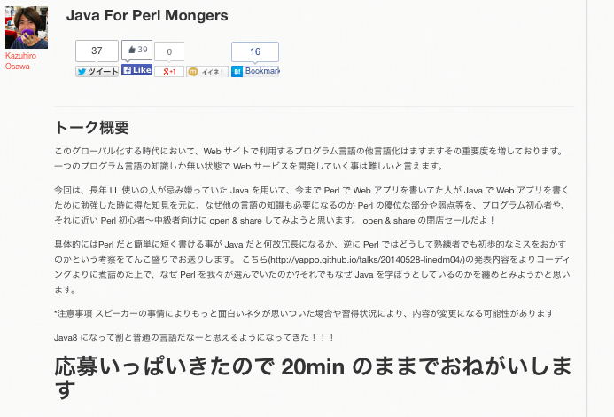

<b style="color:red">*注意事項 スピーカーの事情によりもっと面白いネタが思いついた場合や習得状況により、内容が変更になる可能性があります</b>
---

　
---

ちゃんと Java を覚えようとしたんだけど
---

なんか Java って普通すぎて。。。
---

皆さんに質問です
---

このコードは何で書かれてますか?
---

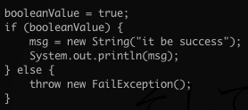

Perl だと思う人?
---

Java だと思う人?
---

なるほど
---

正解は...
---

Java
---

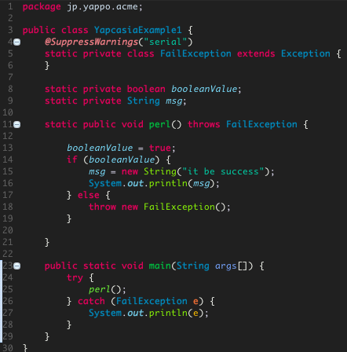

そして
---

Perl
---

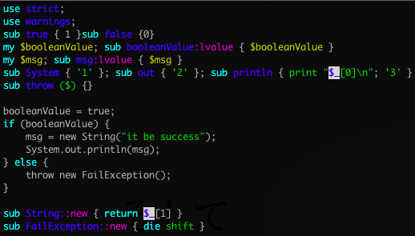

ね? Perl の人達が Java 学ぼうとしても、既に新しく覚える事無くて進捗ダメなんですよ。。。
---

このまま次に進むのもアレなので Perl の不思議な部分の解説を。。。
---

'booleanValue = true;' について
---

lvalue attribute
---

* Perl には変数や関数に特殊な属性を与える attribute という機能がある
* sub booleanValue:lvalue {} の :lvalue の部分が属性(:は無視して良い)
* lvalue は式の左辺に使う事が出来る関数(超要約)
* lvalue の関数の最後に書かれた SCALAR 変数に対して代入可能

なので

    booleanValue = $x; とかすると $booleanValue に $x が代入される

'System.out.println(msg);' について
---

'System.out.println(msg);' を Perl はどう解釈しているか
---

Perl がコードをどのようにして解釈しているかを知る事が出来る B::Deparse というモジュールがあります。(検索キーワード: dankogai B::Deparse)

    perl -MO=Deparse -e 'sub System { "1" }; sub out { "2" }; sub println { print "$_[0]\n"; "3" }; System.out.println("x")' 

このようにして Perl を実行すると System.out.println('x') に関わるコードを Perl はどう解釈しているか解るのです。

ただの文字列連結された文字列として評価されてた
---

'123' という文字列を作っただけでした。

true/false/throw/new は普通の Perl ですよね?
---

このように、基本的にはどのようなプログラム言語も大差はない
---

僕が Java Java 言い出したきっかけ
---

!!! 突然の Java !!!
---

という事で Java やろうとしていて、実際見聞きしてきたりした事を軽く share してみます
---

Java の嫌な所
---

JVM が重い
---

JVM が重い
---

 
きっと、なんとかしてくれる。。。(希望)

重量級のライブラリを沢山使わないといけない
---

エンタープライズ文化だからしょうがない。嫌なら作ったらいい。

コードが冗長だ
---

冗長だからこそ、コンパイル出来たら動くコードだと言うのが保証出来るんだし一長一短かと。
あと IDE 便利ですよ

ファイルが増えまくる
---

1 file/1 class しか書けないの、僕の今の技能レベルだと不満なんですが IDE 便利ですよ

emacs で Java 書きたいんだけど
---

Eclipse で emcas 互換キーバインドあるし IDE 便利ですよ

IDE が重い
---

仕事で使ってるなら最新の MBA とか買うと快適ですよ＾＾

cpanm とか carton がない
---

Google + jar download + IDE の jar import でやったりクラスパス通ってるところにおいといたらいいらしい

maven central reposytory がクソだ
---

って gfx が言ってた気がするけど、おれまだそこまで出来てない。
github に個別に立ててる人とかもいるみたいだね。

情報をググっても DoJa に毛が生えたようなサンプルコードしか出てこない
---

Perl Monger にそれ言う資格があるとでも?

Java の良い所
---

書ける人が多い
---

* 世界的に見ても書ける人が多いので、圧倒的に採用に有利なんじゃないの？しらんけど
* LL とか書ける人にとっても言語的な差異は少ないので潜在ユーザは多いし
* 糞コード書く人は何処にでも居るので、そっちのデメリットは割愛

type safe
---

* 型システム的に間違った型への代入ができない
* メソッドシグニチャと違う呼び出しができない
* コンパイルが通る事 = 正しく動くコードである ※ただし

Perl でも頑張ったら静的にチェックできるよ
---

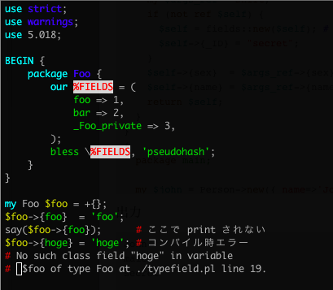

正直こんなの誰も使わないw
---

* 一応コンパイルタイムで hash のアクセス可能な key のチェックしてくれる
* my $foo2 = $foo; したら $foo2 経由で弄り放題
* Danga::Socket のコード見ると、こういうの使われてる
* see also perldoc fields

Java に話をもどして。。
---

やっぱり ORM とかで効果たかい
---

* table 名や column 名の typo する事がなくなる
* IDE が全て補完や警告してくれる
* 全てを無視してコンパイルしても失敗するから、うっかりバグッた SQL を本番で投げなくなる

JSON とかも安全に扱える
---

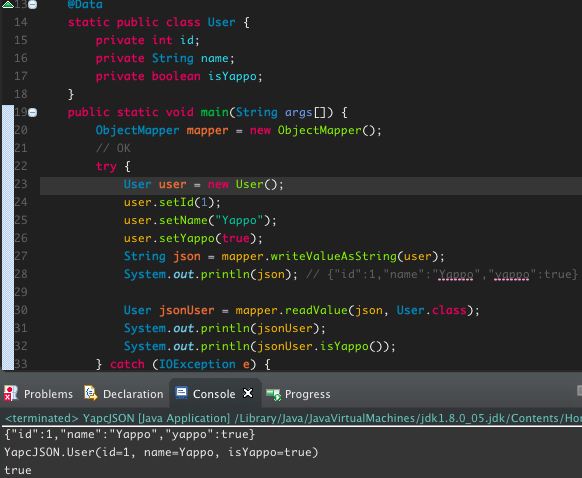

うっかり型が間違ってたら例外も飛ぶ
---

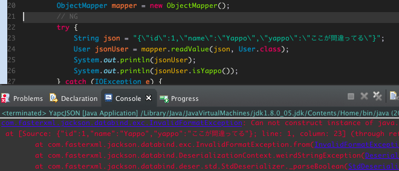

perl って json たいへんですよね
---

int/str
boolean

でも perl だと一発で JSON 作れてべんりーだったり
---

    my $json = JSON::XS->new->ascii->encode(+{
        id    => 1,
        name  => 'Yappo',
        yappo => 'JSON::XS::true,
    });

Java でもやれるんだろうけど type safe の恩恵無くなって Java で書く意味皆無だけど。。。

HASH/ARRAY みたいな物を簡単に構築して利用出来るのが LL の利点ですよねー(型推論の話はおいとく)

Java にはとつぜんのぬるぽあったりするじゃん?
---

でも perl でも
---

    my $row = $tng->single( table => { id => $id } );
    say $row->name;

みたいなコードで $row あるかどうかチェックしないで死ぬコードとかうっかり書く人多くて、そこ言語の差ないよね。

Java の利点っていっても、ぶっちゃけ普通の言語だからあんまり思いつかなかったのでした
---

自分の置かれている状況や環境によって道具を選ぶのがプロなので、僕はたまたま Java Java 言ってるだけですね
---

そういえば Java8 の話するとか言ってました
---

Stream API & lambda
---

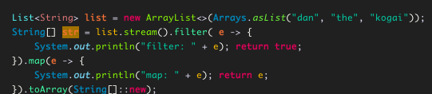

    以下のように表示される
    filter: dan
    map: dan
    filter: the
    map: the
    filter: kogai
    map: kogai

Stream API
---

* stream object を作る
* fliter, map 等の中間操作
* sum, toArray, forEach 等の終端操作
* 終端操作が無いと中間操作は実行されない
* 中間操作を複数書いてもループは1回だけ回るよう最適化

callback が必要なコードは lambda を使えばすっきり
---

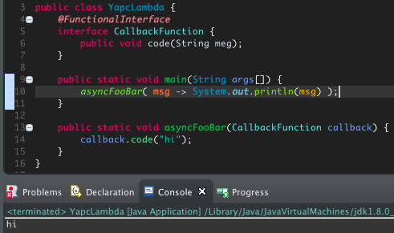

IDE には lambda から Anon Class に置き換える変換機能もついてて
---

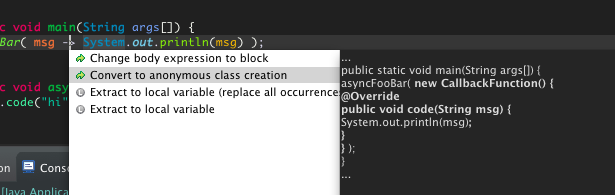

一発で古き Java Style になる
---

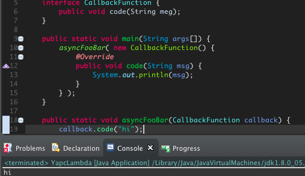

逆に lambda にも一発でおk
---

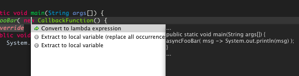

最近はぞんがい waf とかも薄いのある
---

とある amon2 っての作った人が偶然いま作ってる java の waf が Perl Monger にはわかりやすい気がする。
まだ使った事無いけど。

router
---

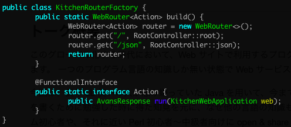

controller
---

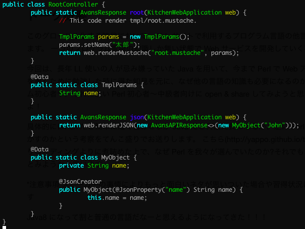

controller
---

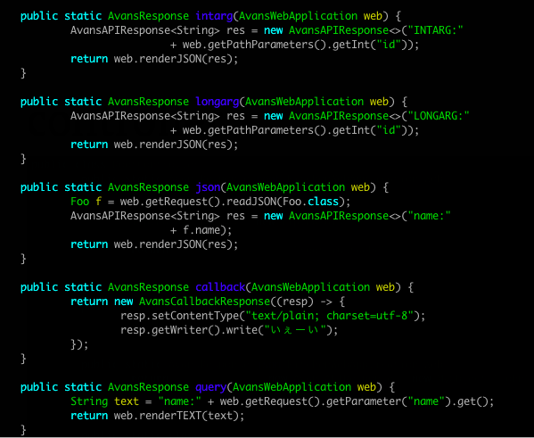

アノテーションとか使ってないってさ
---

perl の attribute みたいなもの。 perl のは attribute つかったコードをデバッグするのとかコード追いかけるの大変だけど java のアノテーションも似てるので、おっかけるの大変らしいね。

それでも我々は Perl を使っていた
---

ここ最後のスライドなので、時間見ながら喋る

以上です
---

何か質問は?
