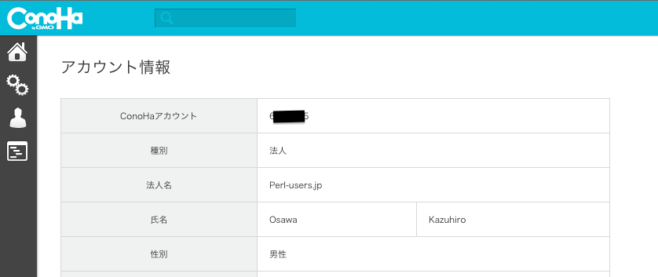
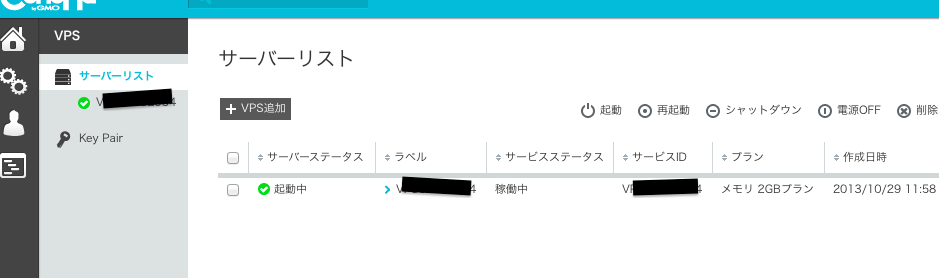
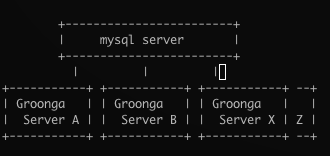

Better Groonga Replication
==========

<address>Yappo   ConoHa presents - Groonga "How-To" Talks</address>

今日の概要
===

僕が Mroonga に頼らずに Groonga で replication 構成を作った理由と実装を紹介します

そのまえに
---

このトークで紹介する仕組みを思い至ったいくつかの大事な要素の一つについての新しい概念を先日思いついたので、そちらの紹介をします

あ
---

ちゃんと ConoHa 使ってます！
---

ちゃんと ConoHa 使ってます！
---

Registration Free という概念のご提案
==========

<address>Yappo   ConoHa presents - Groonga "How-To" Talks</address>

What is registration free?
---

直訳すると「登録自由」とか無料で登録そうな言葉なんですが僕の意味合いとしては「初期設定作業の手間が不要になる！らくちん！」ってイメージです

僕が社内向けツールを作ってきたときは極力設定が少なくなる物を作るようにしていました
---

理由は簡単で「設定が面倒い」

ikachan
---

* IRC に発言するための Web API tool
* 発言させたい irc server を指定して起動するだけで、追加の設定必要なし
* 利用者は API に対して発言先の channel name と message body を送るだけ
* ikachan が知らない channel へ発言する時は ikachan が自動的に channel に入る

GrowthForecast
---

kazeburo さん作だが yappo がプロトタイプを作ったので思想を紹介 

* KPI を簡単にグラフ化したかった
* 様々な案件で簡単に使いたかった
* 将来的には膨大な数のグラフを全自動で作る事を考えると、グラフの作成する設定を一々行ってられないのは自明
* 「じゃぁ利用者が任意の名前の URL にデータをポストしたら勝手にグラフ出来たら自動化しやすくて便利じゃね?」

 という思想のもとプロトタイプを作りました

考え方は単純
---

* system tool は息を吐くように使えるようになれば、それだけで生産性はあがる
* 余計なデータが増える事を怖がる前にエンジニアに取って簡単になるべき
* RESTfull っぽくね
* この設定からの卒業

GitHub とかも repository 作成画面無しで直接 push したら repository できたらまじ捗ると思うんですよ
---

Registration Free については以上です
---

Better Groonga Replication
==========

<address>Yappo   ConoHa presents - Groonga "How-To" Talks</address>

10年くらい前の昔話
---

ガラゲー用の検索サイトやってて Senna + MySQL 頑張ってた

大昔は Senna を使っていた
---

* MySQL バインディング便利
* めちゃくちゃバギーだったからパッチ書きまくった
* 開発者が親切

Senna + MySQL を使うにはコツがあった
---

* 開発者が使ってない使い方はしない
* fulltext index は頻繁に更新しない
* 通常の MySQL の用途としては使わない威
* OFFSET 100000 LIMIT 10 とかで10行しか fetch しない用にするパッチ書いたり

安定運用方法
---

* database を作る
* クローラを回して検索用データを insert しまくる
* URL 別のスコアを計算する
* スコアを基準に検索用のテーブルを ALTER TABLE search_data ORDER BY score とかする(これするとテーブルのレコードが物理的に score 順に並び変わる、ようするに SELECT で ORDER BY しなくてもスコア順の結果が取れるようになる)
* 検索させたいテキストが入ったカラムに fulltext index 張る
* データ差し替えたいときは、またデータベース作り直しで UPDATE/DELETE しない

昔話
---

あんまり今は役にたたない話ここまで

ここ数年以内の話
---

とある事で全文検索が必要な感じになった。JVM で動いている物を安心して使う気にならないので消去法で Groonga を使おうと思った(一応同僚も使ってたし)

 ＜ MySQL のストレージエンジンで使ってよ(超要約)
---

 ＜ Groonga は信用しようって気にはなれるけど with MySQL は信用無理！(過去の経験的に)(超要約)
---

 ＜ じゃぁ困らない感じにしといてよ(超要約)
---

って事で Groonga 単体でサービスを作る事にした
---

Groong + MySQL (Mroonga) の利点
---

* replication 超楽
* matsunobu さんの MHA が使える
* DBI とかで検索クエリ投げれるので言語から使いやすい

Groong + MySQL (Mroonga) の欠点
---

* 闇が深い

Groonga 単独の欠点
---

* れぷりけーしょんどうするの？

無ければ作ったら良いよ
---

という事で、複数の Groonga Server に更新クエリを投げる為の Groonga Proxy Server を作りました。

概念的には pgpool のレプリケーション機能っぽい感じで application は Groonga Proxy Server に対して更新クエリを投げると backend のリアルな Groonga Server にクエリを中継してくれる君だった。

だがしかし！障害のノードの対処やスケールアウト戦略どうするの！！？？！
---

クエリを proxy してるだけだから、実際に運用する事が不可能ってのが作ってみて学びありました。

 ＜ どうしようooえもん〜
---

 ＜ ちょっとまって
---

 ＜ わっふるわっふる
---

 ＜ binlog みたいな仕組みにしたらどう?
---

 ＜ ！！！！１
---

という事で良い感じの replication の仕組みができました
---

特徴
---

* サーバ増設が簡単
* 設定は極わずか
* 追加で必要な daemon は無い
* Groonga のクラスタ内では master - slave という概念無し
* 全 Groonga node が slave という形に近い
  
いわゆる registration free!

システム概略
---

* 適当な MySQL の database に binlog table を作る(id, update_type(insert, update, delete), data(Groonga に送るクエリ情報))
* Groonga 側に slave_status table を作る (pos カラムを作って、ここに処理した binlog table の id を入れる)
* binlog table の id と slave_staus table の pos を比較して、処理してない binlog table の data を元にして update_type で指定したクエリを Groonga に投げる cron script
* cron script は、各 Groonga Server それぞれの中に仕込んでいて、各 Groonga Server は自立的に binlog の更新内容を適用していく
* 他にも細かいエラー処理はしてる

概要図
---

<!--
        +------------------------+
        |     mysql server       |
        +------------------------+
          |         |         |
+-----------+ +-----------+ +-----------+ --+
| Groonga   | | Groonga   | | Groonga   |   |
|  Server A | |  Server B | |  Server X | Z |
+-----------+ +-----------+ +-----------+ --+

-->

簡単なサーバ増設フロー
---

* 各 Groonga Server たちはどこかのレイヤーでバランシングしてる
* 増設したい時は、どこかのノードをバランス対象からはずす
* はずしたら cron や groonga 等を止める
* 一時的にはずしてるノードから新規サーバにデータをコピーする
* もろもろ起動する
* 各ノードが binlog の更新が追いついた感じになったらバランシング対象に戻す

各ノードが処理した binlog の場所を個別で覚えているので、同期とかを気にせず増設していけて便利
---

という説明だけじゃわかりずらいと思うのでリファレンス実装書いてきました
---

madhand
---

<a href="https://github.com/yappo/ruby-madhand">https://github.com/yappo/ruby-madhand</a>  

* ruby 製 (Groonga って ruby の人おおいので。。。あと perl ってだけで読まない人大杉なので。。)
* ruby っぽいキラキラネーム
* どんどんサーバ増えてく事がイメージできる名前
  
デモみてみましょう。

FAQ
---

Q. なぜ Droonga を使わなかったの?
   
A. え、fluentd。。？あれ、、なんか、、、すごく、、、おっきかったです。。。

まとめ
---

* いまのところ安定した運用が出来てます
* 大量のデータ追加削除してもちゃんと動いてる
* 自前で daemon 書くと運用が恐いので、なるべく既存の仕組みだけで HA 確保できる
* こういう特種な仕組みを作ったら障害対応などのオペレーションのドキュメントはちゃんと書く(書いた)
* 困ったら優秀な人に泣きつけ

以上です
===

