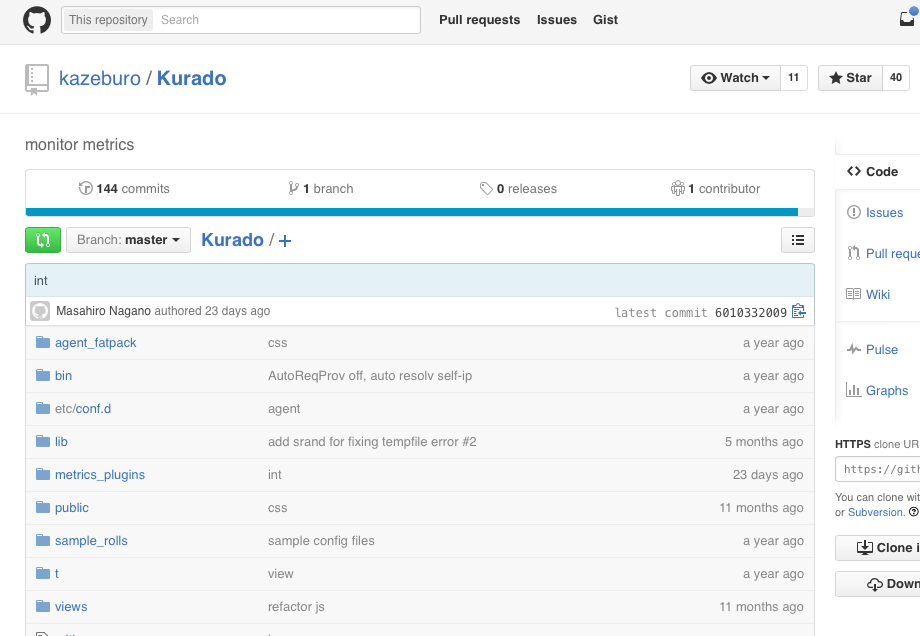
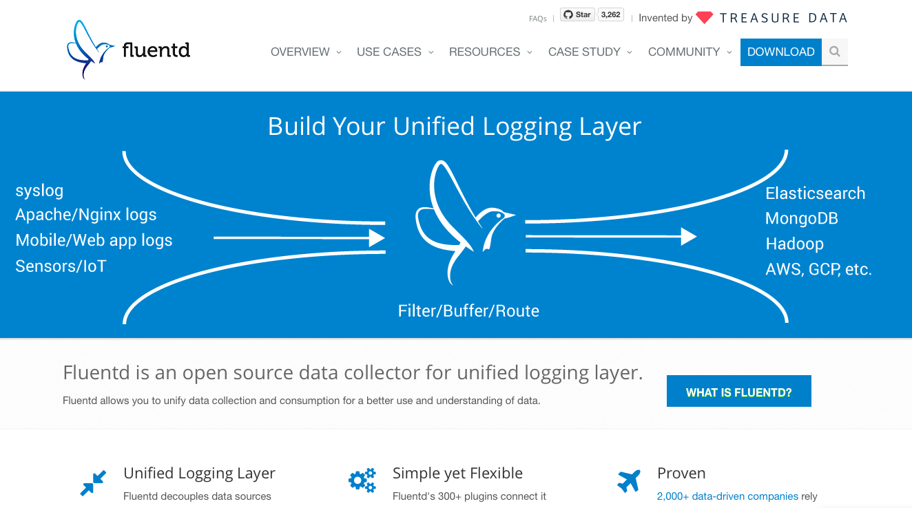

大規模でも小中規模サービスでも捗る microservices な Web サービスのつくりかた How to develop by microservices way
===

<address>Yappo@Shibuya.java  YAPC::Asia Tokyo 2015</address>

Self introduction
---

* Yappo
* JSON Engineer
* around 16-18 years in a web developer career
* use the Java for one month

Don't on this このセッションでやらないこと
---

* Management for human resource 組織論
* Fund 資金

Merit of microservice
---

* scale for service
* can develop it naturally
* focus to simple function

Demerit of microservice
---

* many server components
* many servers
* many repositories
* black box

microservices is Buzz word!
---

Actually that way is basic way for us / 実は普通の開発手法なんです 
I will clarify it in this session / このセッションで説明します

In the world before Web 2.0
---

CGI / FORM tag as a Web API

I begin a talk of Perl4(a little time)
---

裏で Perl6 の話してるので、すこし Perl4 時代の話をします。

new component deployment
---

限定キャンペーンの為に mkdir して FTP して FTP soft で chmod 0755 して release 

scale out
---

スケール戦略は、新しいレン鯖を借りれば OK

Web 2.0 as a microservices
---

Web Service API これらは要するに microservice の考えそのものです。
それが中にあるのか、外にあるのか

Back to the our service
===

本題に戻りましょ

For small services
===

Demerit on a small service
---

* many server components
* many servers
* many repositories

You should do the monolithic architecture on a small service
小さいサービスでは、モノリシックなコードで運用すべき

But can do on a small service for microservices
---

それでもできることある

Let's go up the stairs
---

* 1st step. to write a model
* 2nd step. to use a job worker
* 3rd step. to separate a logic on the service

最初は model で書く、そのうち分離が必要になったら model を別サーバの API の client にして、元からあった model の実装を別サーバ上で提供する

MVC structure as a microservices
===

MVC
---

Please write by the common way

    package Amon2Proj::Web::C::API;
    ...
    sub foo {
      my($class, $c) = @_;
      my $data = Amon2Proj::M::Foo->bar({ ... });
      $c->render_json($data);
    }
    package Amon2Proj::M::Foo;
    sub bar {
      my($class, $input) = @_;
      ...
      return +{ ... };
    }

Job Queue/Worker model
---

* cron
* TheSchwartz

cron
---

    * * * * * setlock /tmp/x.lk cron/batch-foo.pl

    # in batch.pl
    Amon2Proj::Batch::Foo->run;
    # Amon2Proj->bootstrap and some tasks

TheSchwartz enqueue
---

    package Amon2Proj::M::Foo;
    sub bar {
      my($class, $input) = @_; # you should validation to $input
      $job = TheSchwartz::Job->new(
        funcname => 'ImageResize',
        uniqkey  => $input->{item_id},
        arg      => [ foo => 'bar' ],
      );
      $client->insert($job);
      return 1;
    }

TheSchwartz worker
---

    package ImageResize {
      use base qw( TheSchwartz::Worker );
      sub work {
        my($class, $job) = @_;
        my $item_id = $job->uniqkey;
        # to image resize
        $job->completed();
      }
    }
    package main;
    my $client = TheSchwartz->new( databases => $DSN );
    $client->can_do('ImageResize');
    $client->work();

Take it easy, but please mind to common sense and good sense
---

The structure design of this stage is very important

この初期段階の設計が一番大事なので、とてもよく考えて作ってください

For middle scale services
===

What should we do on the middle?
---

中規模のサービスでとるべき戦略とは?

* Separation timing
* Plural projects management

Separation timing
---

When do you separate components from the core service? いつ分離しよう?

特定の機能専用のサーバを作るタイミング
どういう時に別サーバにするか？

* My co-worker need use my service components 他のサービスでも使いたい
* I want that my component provides for other developers 社外でも使って欲しい
* I want scale out

<!--
 - 住所正規化処理を使ってるアプリケーションがあったけど、他のサービスでも使いたくなった場合、住所正規化処理だけ切り出して別サーバ化する
 - 例えば外部向けの Open API で提供したら価値が上がりそうな機能をもってたら、それを切り出して、元のサービスは Open API に依存する
-->

My way is the same as DRY programing
---

DRY の為にコードをコピペせずにメソッド化するのと同じで、複数のサービスで同じことをしなくても済むように、独立したサービスとして運用するのです。
ただし一般ライブラリ単体で可能な機能だけを提供するサービスを作るのは無駄です 

 eg. 電話番号フォーマット check API だけ作るとか

Exception case
---

May you separate complex components by core service?
メンテナンスに手間がかかるモジュールを利用するコンポーネントなどは独立すると捗る

* KENALL.csv (Japanese zip data file, monthly maintenance)
* Number::Phone::JP (monthly maintenance)
* Geocoder, etc...

but thoese functions provided by popular Web Services. You can use it if your company's law be allowed.

How do I run for plural projects management?
---

実質的に複数の service を抱えるので増える管理の手間をどう乗り越えるか?

Deploy method
---

Easy to deploy system is most important on this phase. you can choose the thin shell script system.

このフェーズで一番大事なのは Deploy の簡単さ
 rsync / remote shell 
簡単な shell script でも OK

Repository
---

* In same repository? 既存のサービスの中でやる?
 * Amon2Proj::Web::Dispatcher
 * Amon2Proj::API::Dispatcher
 * Amon2Proj::ForAPI::Dispatcher
 * Amon2Proj::BarAPI::Dispatcher
* Separate out? 分離する?

FQDN/URL
---

* FQDN Separation or same FQDN?
* Nginx chose backend server
 * https://example.com/api/foo/*
 * https://example.com/api/new-microservices-api/*
* Sepatated
 * https://example.com/api/foo/*
 * https://new-microservices-api.example.com/api/*

You must have backward compatibility
---

後方互換性の確保をしないと困る

JSON
---

Basically, we use HTTP-JSON API.

Amon2::Plugin::Web::JSON
---

    # in Amon2Proj/Web.pm
    __PACKAGE__->load_plugins(
      'Web::JSON' => { status_code_field => 'status' }
    );
    # in your
    package Amon2Proj::Web::C::API;
    sub foo {
      my($class, $c) = @_;
      $c->render_json(+{
          status => 200, # create `X-API-Status: 200` response header
          ...
      });
    }

JSON::XS
---

    use JSON::XS;
    
    my $json = JSON::XS->new->ascii;
    my $json_data = $json->encode(+{
      fooFount => $foo_count+0, # cast to IV (because sometime Perl cast to SV in internal)
      isBar    => JSON::XS::true(),
      name     => "$name",
    });

    $data => $json->decode($json_data);

Furl
---

    package Amon2Proj::M::Foo;
    use Furl::HTTP; use JSON::XS;
    sub bar {
      my($class, $input) = @_; # you should validation to $input
      my $json = JSON::XS->new->ascii->encode({ count => $input->{count} });
      my $hirom = Furl::HTTP->new;
      
      my(undef, $code, undef, $headers, $body) = $hirom->post(
        'http://doraperson2015.yapcasia.org/vote/5',
        [
          'Content-Type'   => 'accplication/json',
          'Content-Length' => length($json)
        ],
        $json
      );
      return $code == 200 ? 1 : 0;
    }

In Java8
---

* avans
 * Perl monger friendly Web Application Framework
 * near the Amon2
* tinyorm
 * near the Class:DBI and Teng
* Jackson
 * for the JSON
* mech2
 * near the Furl

avans
---

    POST("/api/hoo")
    public WebResponse hooPost(@JsonParam HooPostReqestObject req) {
      String name = req.getName();
      ...
      return renderJSON(200, new HooResponseObject("foo", 1, name));
    }

Very easy!

Service metrics
---

kurado
---

fluentd
---

For big
===

Documantation
---

* Wiki
* ERD
* UML
 * I like the PlantUML

❤️PlantUML
---

    @startuml ../imgs/web2.0-1.png
    
    cloud "Own iDC" {
      package "www.example.com" {
        [ App1 ] as app1
      }
      package "www.example.org" {
        [ App2 ] as app2
      }
    }
    
    cloud "Hatena" {
      package "Mackernel" {
        [ API ] as mackernel
      }
      package "Bookmark" {
        [ API ] as bookmark
      }
      package "OAuth hatena" {
        [ API ] as hoauth
      }
    }
    
❤️PlantUML
---

    cloud "Mixi" {
      package "OAuth mixi" {
        [ API ] as moauth
      }
    }
    
    cloud "FreakOut" {
      package "AD Server" {
        [ API ] as ad
      }
    }
    
    app1 -> ad
    app1 -> mackernel

    app2 -> ad
    app2 -> mackernel
    app2 -> bookmark
    app1 -> hoauth
    app1 -> moauth
    
    @enduml

❤️PlantUML
---

Why do you make to microservices?
---

* For the general-purpose? 汎用的な機能のため？
* subsystem? サービスのサブシステムのため？

Team buildling
---

* Who is my service user?
* Which server connected to my server?
* Whom should I talk to when my service upgraded?

You will let an expert work
---

専門家がいるなら、その専門家に特定のサービスだけ作ってもらえばよい
あなたが専門家なら、それをすればよい

Last Summary
---

You should anytime write the good components!
正しいコンポーネント化が重要

Do you have any question?
===
